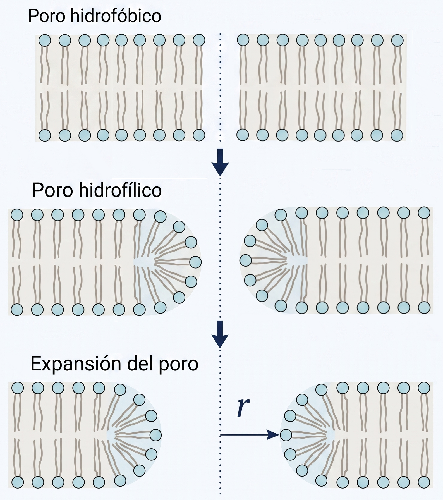

# Objetivo del módulo

Este módulo presenta un modelo energético mínimo para interpretar la nucleación y expansión de poros acuosos en una membrana sometida a voltaje transmembrana.

La idea central es que la electroporación no debe entenderse como una ruptura mecánica directa de la membrana, sino como una modificación del paisaje de energía libre. El voltaje transmembrana reduce la barrera energética asociada a la formación de poros acuosos y puede favorecer estados de mayor permeabilización.

# Punto de partida: segunda ley de la termodinámica

La segunda ley establece que, para un proceso espontáneo en un sistema aislado, la entropía total del universo no disminuye:

$$
dS_{\mathrm{univ}} \ge 0
$$

Si dividimos el universo en sistema y alrededores:

$$
dS_{\mathrm{univ}}
=
dS_{\mathrm{sist}}
+
dS_{\mathrm{alr}}
$$

Para un proceso a temperatura constante, el intercambio de calor reversible con los alrededores puede escribirse como:

$$
dS_{\mathrm{alr}}
=
-\frac{\delta q_{\mathrm{rev}}}{T}
$$

Si además el proceso ocurre a presión constante, el calor intercambiado se relaciona con el cambio de entalpía del sistema:

$$
\delta q_{\mathrm{rev}} = dH_{\mathrm{sist}}
$$

Por tanto:

$$
dS_{\mathrm{univ}}
=
dS_{\mathrm{sist}}
-
\frac{dH_{\mathrm{sist}}}{T}
$$

Multiplicando por $-T$:

$$
-T\,dS_{\mathrm{univ}}
=
dH_{\mathrm{sist}}
-
T\,dS_{\mathrm{sist}}
$$

A temperatura constante, se define la energía libre de Gibbs como:

$$
G = H - TS
$$

y su diferencial, para $T$ constante, es:

$$
dG = dH - T\,dS
$$

Por tanto:

$$
dG = -T\,dS_{\mathrm{univ}}
$$

Como la segunda ley exige que:

$$
dS_{\mathrm{univ}} \ge 0
$$

entonces:

$$
dG \le 0
$$

para procesos espontáneos a temperatura y presión constantes.

::: {.callout-note}
## Lectura física

La energía libre de Gibbs permite evaluar si un cambio estructural puede avanzar espontáneamente bajo ciertas condiciones. En el contexto de la electroporación, no interesa solamente si existe un estado final favorable, sino también si existe una **barrera de energía libre** que debe superarse para formar un poro.
:::

# Energía libre como paisaje estructural

En el caso de una membrana lipídica, podemos describir la formación de un poro mediante una coordenada estructural simple: el radio del poro.

Denotamos esa coordenada como $r$. A cada valor de $r$ le asociamos un cambio de energía libre $\Delta G(r)$, que puede interpretarse como un **paisaje energético**. Si $\Delta G(r)$ presenta una barrera, entonces la formación del poro requiere superar un costo energético inicial.

En términos cualitativos:

- un poro muy pequeño implica crear un borde desfavorable;
- un poro mayor puede estar favorecido por tensión superficial;
- un voltaje transmembrana suficientemente alto puede reducir la barrera de formación.

# Transición estructural del poro

El proceso puede representarse como una transición en tres etapas, ilustradas en @fig-transicion:

1. **Poro hidrofóbico.** Una fluctuación térmica provoca una separación local entre lípidos. Las colas hidrofóbicas quedan expuestas al agua, lo que es energéticamente muy desfavorable. Este estado es inestable y transitorio; el poro colapsa espontáneamente si la fluctuación no es suficientemente grande.

2. **Poro hidrofílico.** Si la perturbación supera un tamaño crítico, las cabezas polares se reorganizan hacia el interior del canal acuoso, formando una interfaz estable con el agua. Este reordenamiento requiere superar una **barrera energética** — es el costo de reorganizar los lípidos del borde — pero una vez superada, el poro hidrofílico puede estabilizarse o expandirse.

3. **Expansión del poro.** El poro hidrofílico crece en radio $r$. Si el voltaje transmembrana es suficientemente alto, la expansión puede ser espontánea e irreversible.

{#fig-transicion fig-alt="Transición estructural desde un poro hidrofóbico hacia un poro hidrofílico y posterior expansión del poro." width=70%}

## ¿Qué es la nucleación?

En física y química, **nucleación** es el proceso por el que una nueva estructura o fase aparece espontáneamente dentro de un sistema, superando una barrera energética inicial. Un ejemplo cotidiano es la formación de burbujas en agua caliente: por debajo de cierto tamaño crítico, la burbuja colapsa porque la presión interna no puede sostener la interfaz; por encima de ese tamaño, la burbuja crece espontáneamente.

En electroporación, la **nucleación del poro hidrofílico** es el momento en que el poro adquiere el tamaño y la estructura suficientes para estabilizarse. Antes de ese punto, cualquier perturbación colapsa. Después de ese punto, el poro puede crecer.

## ¿Qué barrera corresponde a qué en la figura de referencia?

La @fig-paisaje muestra el paisaje energético completo calculado con un modelo más detallado. Es importante no confundir las dos regiones que aparecen:

**El pico pequeño del zoom** (en $r \approx 0.5$ nm, $\Delta G \approx 46\,k_BT$) **no** corresponde al poro hidrofóbico. Corresponde a la **barrera de nucleación del poro hidrofílico**: es el costo energético de que las cabezas polares se reorganicen hacia el interior del canal acuoso. Una vez superado este pico, el poro hidrofílico se estabiliza y puede expandirse. Este es el máximo que el simulador de este módulo identifica como $\Delta G_c$.

**El poro hidrofóbico** ocurre a radios aún menores ($r \lesssim 0.3$ nm) y tiene su propia barrera previa, que en el modelo completo aparece antes del pico del zoom. El modelo simplificado de tres términos que usamos aquí **no incluye esa barrera hidrofóbica** — describe directamente la energética del poro hidrofílico.

**La curva que sube monotónicamente** a voltajes bajos (curva de 0 mV y 150 mV para radios grandes) representa la **barrera de ruptura irreversible**: el costo enorme de expandir el poro hidrofílico a radios de decenas de nanómetros sin la ayuda del campo eléctrico. Esta segunda barrera tampoco está incluida en el modelo simplificado de tres términos.

::: {.callout-note}
## Resumen de las barreras

| Barrera | Radio aproximado | $\Delta G$ aproximado | Incluida en el modelo simplificado |
|---|---|---|---|
| Nucleación hidrofóbica | $< 0.3$ nm | No reportada aquí | No |
| Nucleación hidrofílica ($\Delta G_c$) | $\sim 0.5$ nm | $\sim 40$–$46\,k_BT$ a 0 mV | **Sí** (es lo que muestra el simulador) |
| Ruptura irreversible | $\gg 1$ nm | $\sim 300\,k_BT$ a 0 mV | No |

El simulador modela la barrera de nucleación hidrofílica, que es la barrera relevante para la electroporación en el régimen de campos aplicados.
:::

# Modelo energético mínimo

Una forma simplificada del cambio de energía libre asociado a un poro hidrofílico de radio $r$ es:

$$
\Delta G(r,V_m^{\mathrm{tot}})
\approx
\underbrace{2\pi r\gamma}_{\text{Borde}}
-
\underbrace{\pi r^2\Gamma}_{\text{Tensión}}
-
\underbrace{k r^2\left(V_m^{\mathrm{tot}}\right)^2}_{\text{Eléctrico}}
$$

donde $V_m^{\mathrm{tot}}$ representa el voltaje transmembrana total durante el pulso. En el contexto de los módulos anteriores:

$$
V_m^{\mathrm{tot}}(t)
=
\Delta V_{m,0}
+
\Delta V_m^{\mathrm{ind}}(t)
$$

El modelo energético usa la magnitud del voltaje transmembrana total como variable que modifica la barrera energética.

# Variables y unidades

| Símbolo | Significado físico | Unidad |
|---|---|---|
| $\Delta G$ | Cambio de energía libre asociado a la formación del poro | J |
| $r$ | Radio del poro | m |
| $V_m^{\mathrm{tot}}$ | Voltaje transmembrana total | V |
| $\gamma$ | Energía de línea del borde del poro | J/m |
| $\Gamma$ | Tensión superficial efectiva de la membrana | J/m$^2$ |
| $k$ | Coeficiente efectivo del término eléctrico | F/m$^2$ |

# Origen físico de los parámetros

## Energía de línea $\gamma$

Cuando se forma un poro, los lípidos del borde deben reorganizarse. En un poro hidrofílico, las cabezas polares curvan hacia el interior del canal acuoso, creando una interfaz energéticamente desfavorable entre las colas hidrofóbicas y el agua.

Esta penalización se modela como proporcional al **perímetro** del poro. Para un poro circular de radio $r$:

$$
\text{Perímetro} = 2\pi r
$$

La constante de proporcionalidad $\gamma$ recibe el nombre de **energía de línea** o **tensión de línea** y tiene unidades de J/m (equivalente a N, es decir, fuerza por unidad de longitud).

Su valor se puede estimar a partir de la tensión interfacial entre agua y las colas de los lípidos, combinado con el grosor de la membrana $d_m$:

$$
\gamma \sim \sigma_{\mathrm{hc}} \cdot d_m
$$

donde $\sigma_{\mathrm{hc}}$ es la tensión interfacial agua–hidrocarburo (del orden de 40–50 mN/m) y $d_m \approx 4$ nm. Esto da:

$$
\gamma \sim 0.04\,\text{N/m} \times 4\times10^{-9}\,\text{m}
\approx
1.6 \times 10^{-10}\,\text{N·m/m}
=
0.16\,\text{nN}
$$

En la literatura, valores reportados para membranas lipídicas típicas se encuentran en el rango $\gamma \approx 6$–$15$ pN [@Weaver1996; @Bockmann2008].

::: {.callout-note}
## Por qué $\gamma$ tiene unidades de J/m

La energía de línea $\gamma$ representa la energía libre por unidad de longitud del borde del poro. De la misma forma que una tensión superficial tiene unidades de J/m² (energía por área), una tensión de línea tiene unidades de J/m (energía por longitud). Multiplicada por el perímetro $2\pi r$, da la contribución energética total del borde.
:::

## Tensión superficial efectiva $\Gamma$

La bicapa lipídica en equilibrio puede estar sometida a una **tensión superficial** $\Gamma$ que tiende a expandir su área. Esta tensión surge de la competencia entre:

- la repulsión entre cabezas polares (que tiende a separar los lípidos);
- la atracción entre colas hidrofóbicas (que tiende a compactarlas);
- la presión osmótica y otras fuentes mecánicas externas.

Cuando se forma un poro de radio $r$ en una membrana tensa, el área de membrana se reduce en $\pi r^2$. La energía libre asociada a esa reducción es:

$$
\Delta G_\Gamma = -\Gamma \cdot \pi r^2
$$

Este término es **negativo** porque la tensión superficial libera energía al eliminarse área. Favorece por tanto la expansión del poro.

La magnitud de $\Gamma$ depende del estado mecánico de la membrana. Para membranas en reposo o con tensión residual, $\Gamma$ puede ser muy pequeña (< 0.1 mN/m). Para membranas tensadas mecánicamente o por presión osmótica, $\Gamma$ puede alcanzar 1–5 mN/m. En el contexto de la electroporación, se suele usar el valor representativo $\Gamma \approx 1\,\text{mN/m}$ [@Weaver1996].

::: {.callout-note}
## Diferencia entre $\gamma$ y $\Gamma$

$\gamma$ (minúscula) es la **energía de línea**: se refiere al borde del poro y tiene unidades de J/m. Se opone a la formación del poro.

$\Gamma$ (mayúscula) es la **tensión superficial**: se refiere al área de la membrana y tiene unidades de J/m². Favorece la expansión del poro.

Ambas tienen en común que son densidades energéticas, pero en dimensiones diferentes.
:::

## Coeficiente eléctrico $k$

El término eléctrico representa cómo el voltaje transmembrana reduce la barrera energética. Su origen es la diferencia entre la permitividad del agua ($\varepsilon_w \approx 80\,\varepsilon_0$) y la de la membrana lipídica ($\varepsilon_m \approx 2\,\varepsilon_0$).

Cuando se forma un canal acuoso en la membrana, la energía almacenada en el campo eléctrico disminuye porque el agua es un medio mucho más polarizable que el lípido. Esta ganancia energética puede aproximarse como:

$$
\Delta G_{\mathrm{elec}} \approx -k\, r^2 \left(V_m^{\mathrm{tot}}\right)^2
$$

donde el coeficiente efectivo $k$ puede estimarse a partir de la geometría del poro cilíndrico y las permitividades:

$$
k \approx \frac{\pi\,(\varepsilon_w - \varepsilon_m)\,\varepsilon_0}{d_m}
$$

con $d_m \approx 4$ nm el grosor de membrana. Esto da:

$$
k \approx
\frac{\pi \times (80 - 2) \times 8.854\times10^{-12}\,\text{F/m}}{4\times10^{-9}\,\text{m}}
\approx
0.56\,\text{F/m}^2
$$

Este valor, derivado de la física básica de dieléctricos, es el que se usa como valor por defecto en el simulador.

::: {.callout-note}
## Por qué el término eléctrico es cuadrático en el voltaje

La energía almacenada en un condensador es proporcional a $V^2$. La ganancia energética al reemplazar lípido por agua (un dieléctrico de mayor permitividad) en el poro tiene la misma forma funcional. Por tanto, el efecto no depende del **signo** del voltaje, sino de su **magnitud al cuadrado**. Un voltaje de $-300$ mV produce el mismo efecto sobre la barrera que $+300$ mV.
:::

# Significado de los términos

| Término | Interpretación física |
|---|---|
| $2\pi r\gamma$ | Costo energético de crear el borde del poro; penaliza la nucleación |
| $-\pi r^2\Gamma$ | Reducción de energía al liberar tensión superficial; favorece expansión |
| $-k r^2\left(V_m^{\mathrm{tot}}\right)^2$ | Ganancia energética dieléctrica; reduce la barrera y el radio crítico |

# Radio crítico y barrera energética

Podemos escribir el modelo agrupando los términos cuadráticos:

$$
\Delta G(r)
=
2\pi\gamma r
-
\underbrace{\left[
\pi\Gamma
+
k\left(V_m^{\mathrm{tot}}\right)^2
\right]}_{A}\,r^2
$$

El radio crítico $r_c$ es el radio en el que $\Delta G(r)$ alcanza su máximo. Se obtiene igualando la derivada a cero:

$$
\frac{d\Delta G}{dr}
=
2\pi\gamma
-
2Ar_c
=
0
\qquad
\Longrightarrow
\qquad
r_c
=
\frac{\pi\gamma}{A}
=
\frac{\pi\gamma}
{\pi\Gamma+k\left(V_m^{\mathrm{tot}}\right)^2}
$$

La barrera energética en ese radio crítico es:

$$
\Delta G_c
=
\Delta G(r_c)
=
\frac{\pi^2\gamma^2}
{\pi\Gamma+k\left(V_m^{\mathrm{tot}}\right)^2}
$$

::: {.callout-important}
## Consecuencia biofísica

Al aumentar $\left|V_m^{\mathrm{tot}}\right|$, el denominador $A$ crece. Por tanto, tanto $r_c$ como $\Delta G_c$ **disminuyen**. Esto significa que el voltaje transmembrana facilita la nucleación del poro al reducir simultáneamente el tamaño crítico y la barrera de energía que debe superarse.
:::

# Paisaje de energía libre

La @fig-paisaje muestra el paisaje energético para distintos voltajes. Al aumentar el voltaje transmembrana total, la barrera de nucleación disminuye y el radio crítico se desplaza hacia valores más pequeños.

{#fig-paisaje fig-alt="Paisaje de energía libre del poro en función del radio para diferentes voltajes transmembrana." width=95%}

::: {.callout-note}
## Sobre la figura de referencia y el modelo simplificado

La @fig-paisaje, basada en la literatura [@Weaver1996], muestra un modelo completo con más términos que el presentado aquí. Contiene dos barreras distintas que el modelo de tres términos **no** reproduce:

- La **barrera hidrofóbica** a radios $< 0.3$ nm (previa al pico del zoom).
- La **barrera de ruptura irreversible** que aparece a voltajes bajos como la curva ascendente de 0 mV y 150 mV para radios grandes (~300 $k_BT$).

El **pico pequeño del zoom** en $r \approx 0.5$ nm es la barrera de nucleación del poro **hidrofílico** — no del hidrofóbico. Es precisamente este pico el que el simulador calcula como $\Delta G_c$. La diferencia entre voltajes (0 mV, 150 mV, 300 mV, 450 mV) en el zoom muestra cómo el campo eléctrico reduce esa barrera de nucleación hidrofílica, que es el mecanismo central de la electroporación.
:::

# Simulación interactiva

En esta simulación se explora el modelo mínimo:

$$
\Delta G(r,V_m^{\mathrm{tot}})
\approx
2\pi r\gamma
-
\pi r^2\Gamma
-
k r^2\left(V_m^{\mathrm{tot}}\right)^2
$$

El radio se expresa en nanómetros y la energía en unidades de $k_BT$ a $T = 298$ K. Los valores por defecto corresponden a parámetros físicamente justificados: $\gamma = 9.2$ pN (Weaver 1996), $\Gamma = 1$ mN/m y $k = 556$ mF/m² (estimado desde la permitividad del agua y el grosor de membrana).

::: {.callout-note}
## Instrucciones

Use los controles deslizantes para modificar:

- el voltaje transmembrana total $V_m^{\mathrm{tot}}$, expresado en mV;
- la energía de línea $\gamma$, expresada en pN;
- la tensión superficial efectiva $\Gamma$, expresada en mN/m;
- el coeficiente eléctrico efectivo $k$, expresado en mF/m$^2$;
- el radio máximo mostrado en la gráfica.

La curva gris punteada corresponde a $V_m^{\mathrm{tot}} = 0$. La curva azul corresponde al voltaje seleccionado. El punto naranja indica $r_c$ y $\Delta G_c$.
:::

## Panel interactivo

::: {.columns}

::: {.column width="32%"}

```{ojs}
//| echo: false

viewof V_mV = Inputs.range(
  [0, 600],
  {
    value: 300,
    step: 25,
    label: "Voltaje Vm,total [mV]"
  }
)
```

```{ojs}
//| echo: false

viewof gamma_pN = Inputs.range(
  [1, 30],
  {
    value: 9.2,
    step: 0.1,
    label: "Energía de línea γ [pN]"
  }
)
```

```{ojs}
//| echo: false

viewof Gamma_mNm = Inputs.range(
  [0, 5],
  {
    value: 1.0,
    step: 0.1,
    label: "Tensión Γ [mN/m]"
  }
)
```

```{ojs}
//| echo: false

viewof k_mF_m2 = Inputs.range(
  [1, 1000],
  {
    value: 556,
    step: 1,
    label: "Coeficiente k [mF/m²]"
  }
)
```

```{ojs}
//| echo: false

viewof rmax_nm = Inputs.range(
  [1, 30],
  {
    value: 12,
    step: 0.5,
    label: "Radio máximo [nm]"
  }
)
```

```{ojs}
//| echo: false

T_K   = 298
kB    = 1.380649e-23
kBT   = kB * T_K

V     = V_mV * 1e-3
gamma = gamma_pN * 1e-12
Gamma = Gamma_mNm * 1e-3
kcoef = k_mF_m2 * 1e-3

A = Math.PI * Gamma + kcoef * V * V

rcrit_m  = A > 0 ? Math.PI * gamma / A : NaN
rcrit_nm = rcrit_m * 1e9

Gcrit_J   = A > 0 ? Math.PI * Math.PI * gamma * gamma / A : NaN
Gcrit_kBT = Gcrit_J / kBT

r_nm = Array.from(
  {length: 600},
  (_, i) => 0.01 + i * (rmax_nm - 0.01) / 599
)

datos_poro = r_nm.map(rn => {
  const r  = rn * 1e-9
  const G0 = 2 * Math.PI * r * gamma - Math.PI * r * r * Gamma
  const GV = 2 * Math.PI * r * gamma - Math.PI * r * r * Gamma - kcoef * r * r * V * V
  return {
    r_nm: rn,
    G0_kBT: G0 / kBT,
    GV_kBT: GV / kBT
  }
})

punto_critico = (
  Number.isFinite(rcrit_nm) &&
  rcrit_nm > 0.01 &&
  rcrit_nm <= rmax_nm
)
  ? [{r_nm: rcrit_nm, G_kBT: Gcrit_kBT}]
  : []

G_values = datos_poro.flatMap(d => [d.G0_kBT, d.GV_kBT])
Gmin = Math.min(0, ...G_values)
Gmax = Math.max(5, ...G_values)
```

```{ojs}
//| echo: false

html`
<div style="
  border: 1px solid #d0d7de;
  border-radius: 10px;
  padding: 1rem;
  margin-top: 1rem;
  background: #f8fafc;
  font-size: 0.95rem;
">
  <h4 style="margin-top:0;">Valores calculados</h4>
  <ul style="padding-left:1.2rem;">
    <li><b>V<sub>m</sub><sup>tot</sup>:</b><br>${V_mV.toFixed(0)} mV</li>
    <li><b>γ:</b><br>${gamma_pN.toFixed(1)} pN</li>
    <li><b>Γ:</b><br>${Gamma_mNm.toFixed(2)} mN/m</li>
    <li><b>k:</b><br>${k_mF_m2.toFixed(0)} mF/m²</li>
    <li><b>r<sub>c</sub>:</b><br>${Number.isFinite(rcrit_nm) ? rcrit_nm.toFixed(3) + " nm" : "no definido"}</li>
    <li><b>ΔG<sub>c</sub>:</b><br>${Number.isFinite(Gcrit_kBT) ? Gcrit_kBT.toFixed(2) + " k\u2082T" : "no definido"}</li>
    <li><b>k<sub>B</sub>T (298 K):</b><br>4.11 × 10⁻²¹ J</li>
  </ul>
  <p style="margin-bottom:0; font-size:0.88rem; color:#555;">
    Con los parámetros por defecto:<br>
    ΔG<sub>c</sub>(0 mV) ≈ 64.6 k<sub>B</sub>T<br>
    ΔG<sub>c</sub>(300 mV) ≈ 3.8 k<sub>B</sub>T
  </p>
</div>
`
```

:::

::: {.column width="68%"}

```{ojs}
//| echo: false

Plot.plot({
  width: 500,
  height: 500,
  marginLeft: 80,
  marginRight: 25,
  marginTop: 30,
  marginBottom: 60,
  grid: true,
  x: {
    label: "Radio del poro r [nm] →",
    domain: [0, rmax_nm]
  },
  y: {
    label: "↑ ΔG [kBT]",
    domain: [Gmin * 1.10, Gmax * 1.10]
  },
  marks: [
    Plot.ruleY([0], {
      stroke: "black",
      strokeOpacity: 0.6
    }),
    Plot.line(datos_poro, {
      x: "r_nm",
      y: "G0_kBT",
      stroke: "#6b7280",
      strokeWidth: 2,
      strokeDasharray: "5,5"
    }),
    Plot.line(datos_poro, {
      x: "r_nm",
      y: "GV_kBT",
      stroke: "#1f4e79",
      strokeWidth: 3
    }),
    Plot.dot(punto_critico, {
      x: "r_nm",
      y: "G_kBT",
      r: 5,
      fill: "#d95f02"
    }),
    Plot.ruleX(
      punto_critico.map(d => d.r_nm),
      {
        stroke: "#d95f02",
        strokeDasharray: "4,4",
        strokeWidth: 1.4
      }
    ),
    Plot.text(
      punto_critico.map(d => ({
        r_nm: d.r_nm,
        G_kBT: d.G_kBT,
        label: `ΔGc = ${d.G_kBT.toFixed(1)} kBT`
      })),
      {
        x: "r_nm",
        y: "G_kBT",
        text: "label",
        dx: 8,
        dy: -10,
        fontSize: 11,
        fill: "#d95f02"
      }
    ),
    Plot.text(
      [
        {
          r_nm: rmax_nm * 0.70,
          G_kBT: datos_poro[Math.floor(datos_poro.length * 0.70)].G0_kBT,
          label: "V = 0 mV"
        },
        {
          r_nm: rmax_nm * 0.70,
          G_kBT: datos_poro[Math.floor(datos_poro.length * 0.70)].GV_kBT,
          label: `V = ${V_mV.toFixed(0)} mV`
        }
      ],
      {
        x: "r_nm",
        y: "G_kBT",
        text: "label",
        dy: -8,
        fontSize: 11,
        fill: "#374151"
      }
    )
  ]
})
```

:::

:::

# Cómo interpretar la simulación

La curva gris punteada representa el paisaje energético de referencia para $V_m^{\mathrm{tot}} = 0$. La curva azul representa el paisaje energético para el voltaje seleccionado. El punto naranja marca la barrera de nucleación $\Delta G_c$ al radio crítico $r_c$.

Con los parámetros por defecto ($\gamma = 9.2$ pN, $\Gamma = 1$ mN/m, $k = 556$ mF/m²):

- A $V = 0$ mV: $r_c \approx 9.2$ nm, $\Delta G_c \approx 64.6\,k_BT$ — la nucleación espontánea es extremadamente improbable.
- A $V = 300$ mV: $r_c \approx 0.54$ nm, $\Delta G_c \approx 3.8\,k_BT$ — la barrera es comparable a las fluctuaciones térmicas; la nucleación se vuelve probable.

El término eléctrico que produce este cambio es:

$$
-k r^2\left(V_m^{\mathrm{tot}}\right)^2
$$

Al aumentar $V_m^{\mathrm{tot}}$, este término se hace más negativo, reduciendo tanto la altura como el radio de la barrera.

::: {.callout-warning}
## Precaución física

Este modelo es deliberadamente simplificado y describe únicamente la barrera de nucleación del poro hidrofílico. No incluye la barrera hidrofóbica previa (a radios $< 0.3$ nm) ni la barrera de ruptura irreversible a radios grandes (~300 $k_BT$ a 0 mV). La figura de referencia (@fig-paisaje) utiliza un modelo más completo que incorpora ambas barreras adicionales. Los valores numéricos del simulador deben interpretarse como una exploración cualitativa y pedagógica de la barrera de nucleación hidrofílica, no como una descripción completa del paisaje energético del poro.
:::

## Código para Google Colab

El panel anterior funciona directamente en el portal. El siguiente código se ofrece solo para estudiantes que deseen reproducir o modificar la simulación en Python.

```python
import numpy as np
import matplotlib.pyplot as plt
from ipywidgets import interact, FloatSlider

def simular_paisaje_poro(
    V_mV=300,
    gamma_pN=9.2,
    Gamma_mNm=1.0,
    k_mF_m2=556,
    rmax_nm=12
):
    """
    Simulación didáctica del paisaje de energía libre del poro.

    Modelo:
        ΔG(r, V) = 2π r γ  −  π r² Γ  −  k r² V²

    Parámetros por defecto basados en la literatura:
        γ = 9.2 pN   (Weaver 1996)
        Γ = 1.0 mN/m (tensión superficial de membrana bajo campo)
        k = 556 mF/m² (estimado desde permitividades: π(εw−εm)ε0/dm)
        V = 300 mV   (voltaje transmembrana típico en electroporación)

    Unidades de entrada:
        V_mV      : voltaje transmembrana total en mV
        gamma_pN  : energía de línea en pN = 10⁻¹² J/m
        Gamma_mNm : tensión superficial efectiva en mN/m = 10⁻³ J/m²
        k_mF_m2   : coeficiente eléctrico en mF/m² = 10⁻³ F/m²
        rmax_nm   : radio máximo mostrado en nm
    """

    T   = 298
    kB  = 1.380649e-23
    kBT = kB * T

    V     = V_mV * 1e-3
    gamma = gamma_pN * 1e-12
    Gamma = Gamma_mNm * 1e-3
    kcoef = k_mF_m2 * 1e-3

    r_nm = np.linspace(0.01, rmax_nm, 600)
    r    = r_nm * 1e-9

    G0 = 2*np.pi*r*gamma - np.pi*r**2*Gamma
    GV = 2*np.pi*r*gamma - np.pi*r**2*Gamma - kcoef*r**2*V**2

    G0_kBT = G0 / kBT
    GV_kBT = GV / kBT

    A = np.pi*Gamma + kcoef*V**2

    if A > 0:
        rc     = np.pi*gamma / A
        Gc     = np.pi**2 * gamma**2 / A
        rc_nm  = rc * 1e9
        Gc_kBT = Gc / kBT
    else:
        rc_nm  = np.nan
        Gc_kBT = np.nan

    fig, ax = plt.subplots(figsize=(9, 5.5))
    ax.plot(r_nm, G0_kBT, linestyle="--", linewidth=2,
            color="#6b7280", label="V = 0 mV")
    ax.plot(r_nm, GV_kBT, linewidth=2.8,
            color="#1f4e79", label=f"V = {V_mV:.0f} mV")
    ax.axhline(0, linewidth=0.8, color="black", alpha=0.6)

    if np.isfinite(rc_nm) and rc_nm <= rmax_nm:
        ax.scatter([rc_nm], [Gc_kBT], zorder=5, color="#d95f02", s=60)
        ax.axvline(rc_nm, linestyle=":", linewidth=1.5, color="#d95f02", alpha=0.7)
        ax.text(rc_nm + 0.1, Gc_kBT,
                f"ΔGc = {Gc_kBT:.1f} kBT\nrc = {rc_nm:.3f} nm",
                va="bottom", color="#d95f02", fontsize=9)

    ax.set_xlabel("Radio del poro r [nm]")
    ax.set_ylabel("ΔG [kBT]")
    ax.set_title("Paisaje de energía libre del poro")
    ax.grid(True, alpha=0.3)
    ax.legend()
    plt.tight_layout()
    plt.show()

    print(f"V_m^tot = {V_mV:.0f} mV")
    print(f"γ       = {gamma_pN:.2f} pN")
    print(f"Γ       = {Gamma_mNm:.2f} mN/m")
    print(f"k       = {k_mF_m2:.0f} mF/m²")
    print(f"r_c     = {rc_nm:.4f} nm")
    print(f"ΔG_c    = {Gc_kBT:.2f} kBT")

interact(
    simular_paisaje_poro,
    V_mV=FloatSlider(
        value=300, min=0, max=600, step=25,
        description="V [mV]"
    ),
    gamma_pN=FloatSlider(
        value=9.2, min=1, max=30, step=0.1,
        description="γ [pN]"
    ),
    Gamma_mNm=FloatSlider(
        value=1.0, min=0, max=5, step=0.1,
        description="Γ [mN/m]"
    ),
    k_mF_m2=FloatSlider(
        value=556, min=1, max=1000, step=1,
        description="k [mF/m²]"
    ),
    rmax_nm=FloatSlider(
        value=12, min=1, max=30, step=0.5,
        description="r max [nm]"
    )
)
```

# Preguntas para explorar

1. ¿Qué ocurre con la barrera energética $\Delta G_c$ cuando aumenta $V_m^{\mathrm{tot}}$?
2. ¿Qué ocurre con el radio crítico $r_c$ cuando aumenta $V_m^{\mathrm{tot}}$?
3. ¿Por qué el término eléctrico depende de $\left(V_m^{\mathrm{tot}}\right)^2$ y no simplemente de $V_m^{\mathrm{tot}}$?
4. ¿Qué efecto tiene aumentar la energía de línea $\gamma$?
5. ¿Qué efecto tiene aumentar la tensión superficial efectiva $\Gamma$?
6. ¿Por qué una barrera energética alta hace menos probable la nucleación de un poro?
7. Con los parámetros por defecto, ¿a qué voltaje aproximado la barrera $\Delta G_c$ cae por debajo de $5\,k_BT$?
8. ¿Por qué este modelo no reproduce la segunda barrera de ruptura irreversible visible en la figura de referencia?

# Alcance y limitaciones

Este modelo energético es útil para construir intuición biofísica, pero es una representación mínima. No describe de manera completa todos los procesos moleculares involucrados en la electroporación.

Entre sus limitaciones principales están:

- supone una geometría idealizada del poro (cilíndrico, radio uniforme);
- agrupa efectos eléctricos complejos en un solo coeficiente efectivo $k$;
- no describe la transición hidrofóbico–hidrofílico como una barrera separada;
- no incluye fluctuaciones térmicas de manera estocástica;
- no reproduce la barrera de ruptura irreversible a voltajes bajos;
- no incluye composición lipídica específica ni proteínas de membrana;
- no describe la dinámica molecular detallada de formación y cierre del poro;
- no representa explícitamente cambios de conductancia durante la permeabilización.

Por tanto, debe usarse como una herramienta conceptual para entender cómo el voltaje transmembrana puede modificar la barrera energética de formación del poro.

# Ideas clave

- La energía libre de Gibbs permite evaluar la dirección espontánea de procesos a temperatura y presión constantes.
- La formación de un poro puede representarse mediante un paisaje energético $\Delta G(r)$.
- El término de borde $2\pi r\gamma$ penaliza la formación inicial del poro; $\gamma$ es la energía de línea del borde hidrofílico.
- El término de tensión $-\pi r^2\Gamma$ favorece la expansión del poro; $\Gamma$ es la tensión superficial de la membrana.
- El término eléctrico $-k r^2 (V_m^{\mathrm{tot}})^2$ refleja la ganancia energética dieléctrica al sustituir lípido por agua en el poro.
- El coeficiente $k$ puede estimarse desde la permitividad del agua y el grosor de membrana: $k \approx \pi(\varepsilon_w - \varepsilon_m)\varepsilon_0/d_m \approx 556\,\text{mF/m}^2$.
- El voltaje transmembrana reduce tanto el radio crítico $r_c$ como la barrera $\Delta G_c$.
- A voltajes típicos de electroporación (~300 mV), la barrera cae a valores comparables a las fluctuaciones térmicas, haciendo la nucleación probable.
- La electroporación debe interpretarse como una transición estructural favorecida por el campo, no como una ruptura mecánica simple.

# Referencias

Ver @Weaver1996, @Bockmann2008, @Kotnik2019, @Kotulska2007, @Antonov2009 y @Rems2017.
