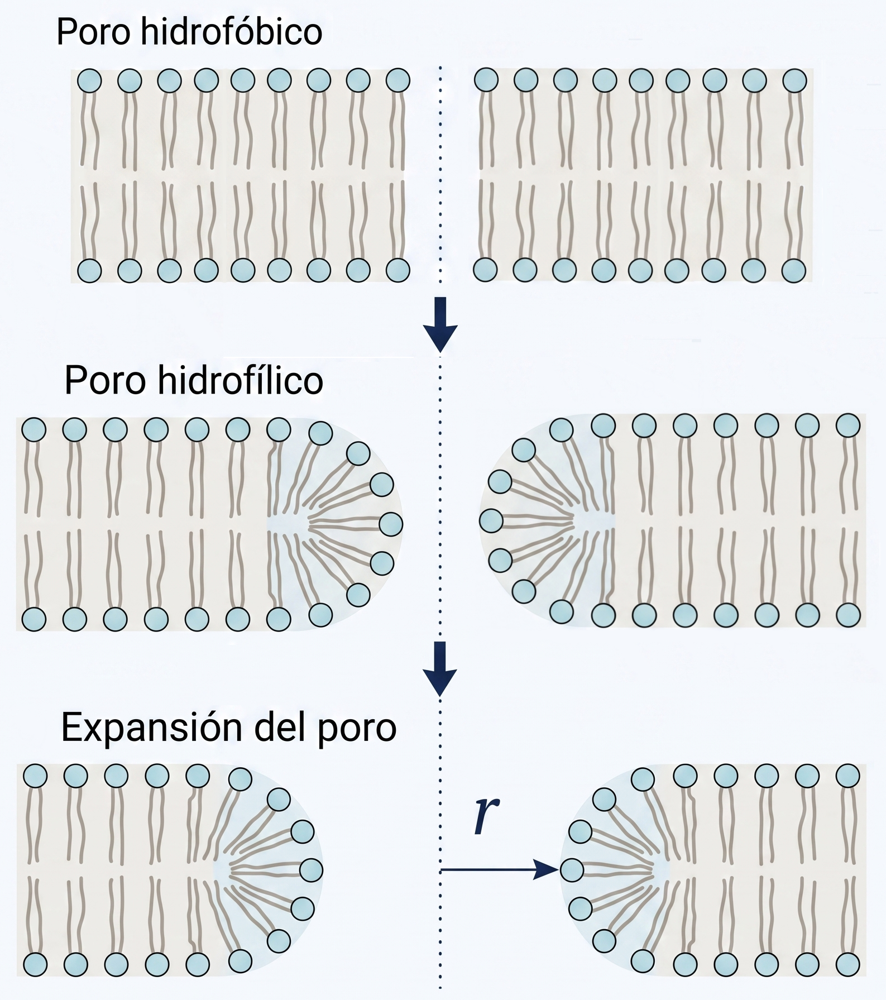

# Propósito del módulo

Este módulo presenta un modelo energético mínimo para interpretar la nucleación y expansión de poros acuosos en una biomembrana sometida a voltaje transmembrana.

La electroporación no debe entenderse como una ruptura mecánica directa de la bicapa, sino como una modificación del **paisaje de energía libre**: el voltaje transmembrana reduce la barrera energética asociada a la formación de poros acuosos y puede favorecer estados de mayor permeabilización. El objetivo es construir esa interpretación desde la termodinámica y llegar al modelo cuantitativo paso a paso.

Este módulo puede recorrerse de manera autónoma; se recomienda haber revisado previamente los módulos sobre la [estructura de la biomembrana](00_introduccion_membrana.qmd) y la [ecuación de Schwan](01_schwan_laplace.qmd).

# Punto de partida: segunda ley de la termodinámica

La segunda ley establece que, para un proceso espontáneo en un sistema aislado, la entropía total del universo no disminuye:

$$
dS_{\mathrm{univ}} \ge 0
$$

Separando el universo en sistema y alrededores:

$$
dS_{\mathrm{univ}}
=
dS_{\mathrm{sist}}
+
dS_{\mathrm{alr}}
$$

Para un proceso a temperatura constante, el intercambio de calor reversible con los alrededores puede escribirse como $dS_{\mathrm{alr}} = -\delta q_{\mathrm{rev}}/T$. Si además el proceso ocurre a presión constante, el calor intercambiado se identifica con el cambio de entalpía del sistema, $\delta q_{\mathrm{rev}} = dH_{\mathrm{sist}}$. Por tanto:

$$
dS_{\mathrm{univ}}
=
dS_{\mathrm{sist}}
-
\frac{dH_{\mathrm{sist}}}{T}
$$

Multiplicando por $-T$ y definiendo la **energía libre de Gibbs** como $G = H - TS$, su diferencial a temperatura constante es:

$$
dG = dH - T\,dS = -T\,dS_{\mathrm{univ}}
$$

Como la segunda ley exige $dS_{\mathrm{univ}} \ge 0$, se concluye que:

$$
dG \le 0
$$

para cualquier proceso espontáneo a temperatura y presión constantes.

::: {.callout-note}
## Lectura física

En el contexto de la electroporación, no interesa solo si existe un estado final favorable ($dG < 0$), sino también si hay una **barrera de energía libre** que debe superarse para llegar a ese estado. La altura de esa barrera determina si la formación de un poro es probable en la escala de tiempo del experimento.
:::

# Energía libre como paisaje estructural

La formación de un poro en la biomembrana puede describirse mediante una coordenada estructural natural: el **radio del poro** $r$ (en m). A cada valor de $r$ se asocia un cambio de energía libre $\Delta G(r)$, que representa el costo o la ganancia energética de tener un poro de ese tamaño.

La función $\Delta G(r)$ define un **paisaje energético**. Si este paisaje presenta un máximo (una barrera), entonces la formación del poro requiere superar un costo energético inicial. Si el máximo es alto, la nucleación es rara. Si el voltaje transmembrana reduce ese máximo, la nucleación se vuelve más probable.

# Transición estructural del poro

El proceso de formación del poro puede representarse como una transición en tres etapas, ilustradas en @fig-transicion:

1. **Poro hidrofóbico.** Una fluctuación térmica provoca una separación local entre lípidos. Las colas hidrofóbicas quedan expuestas al agua —un entorno que les es desfavorable— y el poro colapsa espontáneamente si la perturbación no es suficientemente grande.

2. **Poro hidrofílico.** Si la perturbación supera un tamaño crítico, las cabezas polares se reorganizan hacia el interior del canal, formando una interfaz estable con el agua. Este reordenamiento requiere superar una **barrera energética** —el costo de doblar y reorientar los lípidos del borde— pero una vez superada, el poro hidrofílico puede estabilizarse o expandirse.

3. **Expansión del poro.** El poro hidrofílico crece en radio $r$. Si el voltaje transmembrana es suficientemente alto, la expansión puede ser espontánea e irreversible.

{#fig-transicion fig-alt="Transición estructural desde un poro hidrofóbico hacia un poro hidrofílico y posterior expansión del poro." width=70%}

## ¿Qué es la nucleación?

En física y química, **nucleación** es el proceso por el que una nueva estructura o fase aparece espontáneamente dentro de un sistema superando una barrera energética inicial. Un ejemplo cotidiano es la formación de burbujas en agua caliente: por debajo de un tamaño crítico, la burbuja colapsa porque la presión interna no puede sostener la interfaz; por encima de ese tamaño, crece espontáneamente.

En electroporación, la **nucleación del poro hidrofílico** ocurre cuando la perturbación alcanza el tamaño y la estructura necesarios para estabilizarse como poro con recubrimiento lipídico. Antes de ese punto, cualquier fluctuación colapsa. Después de ese punto, el poro puede crecer.

## ¿Qué barrera corresponde a qué en la figura de referencia?

La @fig-paisaje muestra el paisaje energético completo calculado con un modelo más detallado [@Weaver1996]. Conviene no confundir las dos regiones que aparecen:

**El pico pequeño** (en $r \approx 0.5$ nm, $\Delta G \approx 46\,k_BT$) **no** corresponde al poro hidrofóbico. Corresponde a la **barrera de nucleación del poro hidrofílico**: es el costo de que las cabezas polares se reorganicen hacia el interior del canal acuoso. Una vez superado este pico, el poro hidrofílico se estabiliza. Este es el máximo que el simulador de este módulo identifica como $\Delta G_c$.

**El poro hidrofóbico** ocurre a radios aún menores ($r \lesssim 0.3$ nm) y tiene su propia barrera previa, que en el modelo completo aparece antes del pico. El modelo simplificado de tres términos que se usa en este módulo **no incluye esa barrera hidrofóbica**.

**La curva ascendente** a voltajes bajos (curvas de 0 mV y 150 mV para radios grandes) representa la **barrera de ruptura irreversible**: el costo enorme de expandir el poro a radios de decenas de nanómetros sin la ayuda del campo. Esta segunda barrera tampoco está incluida en el modelo de tres términos.

::: {.callout-note}
## Resumen de las barreras

| Barrera | Radio aproximado | $\Delta G$ aproximado | Incluida en el modelo simplificado |
|---|---|---|---|
| Nucleación hidrofóbica | $< 0.3$ nm | No reportada aquí | No |
| Nucleación hidrofílica ($\Delta G_c$) | $\sim 0.5$ nm | $\sim 40$–$46\,k_BT$ a 0 mV | **Sí** |
| Ruptura irreversible | $\gg 1$ nm | $\sim 300\,k_BT$ a 0 mV | No |

El simulador modela la barrera de nucleación hidrofílica, que es la barrera relevante para la electroporación en el régimen de campos aplicados.
:::

# Modelo energético mínimo: construcción término a término

## ¿Por qué tres términos?

El paisaje de energía libre de un poro hidrofílico de radio $r$ resulta de la competencia entre tres efectos físicos distintos, cada uno con una dependencia diferente en $r$. A continuación se construye cada término desde sus fundamentos y se justifica su forma funcional antes de escribir la ecuación completa.

## Término 1: costo del borde — energía de línea $\gamma$

### La analogía con la tensión superficial

Para entender la energía de línea, conviene recordar primero qué es la **tensión superficial**: es la energía libre necesaria para aumentar la superficie de un líquido en una unidad de área. Si se tira de una película de agua (por ejemplo, con un marco de alambre), el trabajo que hay que hacer es proporcional al aumento de área: $\delta W = \sigma \cdot \delta A$, donde $\sigma$ es la tensión superficial (J/m²). La razón física es que en la superficie los enlaces con los vecinos son incompletos —hay "moléculas descontentas"— y crear más superficie expone más de esas moléculas al vacío o al aire.

### La energía de línea como análogo unidimensional

La **energía de línea** $\gamma$ (también llamada **tensión lineal** o **tensión de línea**) es el análogo unidimensional de la tensión superficial: es la energía libre por unidad de **longitud** del borde del poro (J/m). Si crear una unidad de área de superficie cuesta $\sigma$, crear una unidad de longitud de borde de poro hidrofílico cuesta $\gamma$.

¿Por qué se llama "lineal"? Porque la grandeza que se crea es un contorno, una línea —el borde circular del poro— y no una superficie. De la misma manera que la tensión superficial mide el costo por unidad de área, la tensión lineal mide el costo por unidad de longitud de ese contorno.

### ¿Qué hay físicamente en el borde?

En un poro hidrofílico, los lípidos del borde han girado sus cabezas polares hacia el interior del canal acuoso, de modo que las colas hidrofóbicas ya no quedan expuestas al agua. Este reordenamiento tiene un costo: para curvar y reorientar los lípidos del borde, hay que deformar la bicapa localmente. Además, en el borde persiste una pequeña área donde las colas de los lípidos del borde siguen estando en contacto con el agua —o muy cerca de ella—, lo que contribuye con una energía interfacial proporcional al grosor de la bicapa $d_m$.

Este costo puede estimarse combinando la tensión interfacial agua-hidrocarburo ($\sigma_{\mathrm{hc}} \approx 40$–$50$ mN/m) con el espesor de la zona hidrofóbica de la membrana ($d_m \approx 4$ nm):

$$
\gamma \sim \sigma_{\mathrm{hc}} \cdot d_m
\approx
0.04~\mathrm{N/m} \times 4 \times 10^{-9}~\mathrm{m}
\approx 0.16~\mathrm{nN}
= 0.16 \times 10^{-9}~\mathrm{J/m}
$$

Los valores reportados en la literatura para membranas lipídicas típicas se encuentran en el rango $\gamma \approx 6$–$15~\mathrm{pN}$ [@Weaver1996; @Bockmann2008], en acuerdo de orden de magnitud con esta estimación.

Para un poro circular de radio $r$, el perímetro es $2\pi r$ y la contribución a la energía libre es:

$$
\Delta G_{\mathrm{borde}}(r) = 2\pi r\,\gamma
$$ {#eq-borde}

Este término es **positivo** (costo energético) y **lineal** en $r$: crece proporcionalmente al tamaño del poro. Para radios pequeños, es el término dominante y se opone a la formación del poro.

::: {.callout-note}
## Diferencia entre $\gamma$ y tensión superficial

La **tensión superficial** $\Gamma$ (J/m²) describe el costo de aumentar el **área** de la bicapa. La **energía de línea** $\gamma$ (J/m) describe el costo de aumentar la **longitud del borde** del poro. Ambas son densidades energéticas, pero en dimensiones distintas: una en 2D (área), otra en 1D (longitud). Multiplicada por el perímetro $2\pi r$, la energía de línea da la contribución total del borde al paisaje energético.
:::

## Término 2: tensión superficial de la bicapa — $\Gamma$

### ¿Qué hace la tensión superficial de la membrana?

La bicapa lipídica en equilibrio puede estar sometida a una **tensión superficial** $\Gamma$ (J/m²). Esta tensión surge de la competencia entre la repulsión entre cabezas polares (que tiende a separar los lípidos y aumentar el área), la atracción entre colas hidrofóbicas (que tiende a compactarlas) y fuerzas mecánicas externas como presión osmótica o estiramiento celular.

Una membrana en tensión es, en cierto modo, como una goma elástica estirada: quiere contraerse. Si se abre un poro en ella, el área de membrana se **reduce** en $\pi r^2$ (el área del disco que desaparece al abrir el hueco) y la membrana se "relaja" parcialmente, liberando energía. Por eso el término es negativo en el paisaje energético:

$$
\Delta G_\Gamma(r) = -\Gamma \cdot \pi r^2
$$ {#eq-tension}

Este término es **negativo** (ganancia de energía) y **cuadrático** en $r$: crece más rápido que el término de borde al aumentar $r$. Para poros grandes, es el término que domina y **favorece la expansión** del poro.

Para membranas en reposo, $\Gamma$ es muy pequeña (< 0.1 mN/m). Para membranas tensadas mecánicamente, $\Gamma$ puede alcanzar 1–5 mN/m. En el contexto de la electroporación se suele usar $\Gamma \approx 1~\mathrm{mN/m}$ como valor representativo [@Weaver1996].

### ¿Por qué $\Gamma$ favorece la apertura y $\gamma$ la cierra?

La competencia entre ambos términos es la clave del paisaje energético. Para poros pequeños, el borde cuesta más de lo que se gana relajando la tensión ($2\pi r\gamma > \pi r^2\Gamma$ cuando $r < 2\gamma/\Gamma$), de modo que el poro tiende a cerrarse. Para poros grandes, la ganancia de tensión supera el costo del borde y el poro tiende a expandirse. El radio en el que estos dos efectos se equilibran —y que, combinado con el término eléctrico, da lugar al radio crítico— se obtiene en la siguiente sección.

## Término 3: ganancia dieléctrica — coeficiente eléctrico $k$

### Origen físico

Cuando se forma un poro de radio $r$ en la bicapa, la columna de lípido (dieléctrico de baja permitividad, $\varepsilon_m \approx 2\varepsilon_0$) es reemplazada por una columna de agua (dieléctrico de alta permitividad, $\varepsilon_w \approx 80\varepsilon_0$). La energía almacenada en un capacitor de área $\pi r^2$ y espesor $d_m$ con voltaje $V_m^{\mathrm{tot}}$ es proporcional a la permitividad del material; al pasar de lípido a agua, esa energía **disminuye** porque el agua apantalla mejor el campo:

$$
\Delta G_{\mathrm{elec}}(r) \approx -k\,r^2\,\left(V_m^{\mathrm{tot}}\right)^2
$$ {#eq-electrico}

El coeficiente $k$ (en F/m²) puede estimarse a partir de la geometría cilíndrica del poro y las permitividades:

$$
k \approx \frac{\pi\,(\varepsilon_w - \varepsilon_m)\,\varepsilon_0}{d_m}
$$ {#eq-k}

Con $\varepsilon_w - \varepsilon_m \approx 78$, $\varepsilon_0 = 8.854 \times 10^{-12}$ F/m y $d_m = 4~\mathrm{nm}$:

$$
k \approx
\frac{\pi \times 78 \times 8.854 \times 10^{-12}~\mathrm{F/m}}{4 \times 10^{-9}~\mathrm{m}}
\approx
0.556~\mathrm{F/m^2}
= 556~\mathrm{mF/m^2}
$$ {#eq-k-valor}

Este término es **negativo** (ganancia energética), **cuadrático** en $r$ y **cuadrático** en $V_m^{\mathrm{tot}}$. Por eso el efecto no depende del signo del voltaje: $+300~\mathrm{mV}$ y $-300~\mathrm{mV}$ producen la misma reducción de barrera.

::: {.callout-note}
## ¿Por qué el término eléctrico es cuadrático en el voltaje?

La energía almacenada en un condensador es $U = \frac{1}{2}C V^2$: siempre proporcional a $V^2$. La ganancia al sustituir lípido ($\varepsilon_m$) por agua ($\varepsilon_w$) en el poro tiene la misma forma funcional. El efecto depende solo de la magnitud del voltaje, no de su signo.
:::

## El modelo completo

Los tres términos se construyen sobre tres fundamentos físicos distintos —costo de crear un contorno, relajación de tensión superficial, y ganancia dieléctrica— y tienen dependencias en $r$ que se compensan mutuamente. La energía libre total del poro hidrofílico de radio $r$ es su suma:

$$
\Delta G(r,\,V_m^{\mathrm{tot}})
\approx
\underbrace{2\pi r\,\gamma}_{\text{Borde (positivo)}}
-
\underbrace{\pi r^2\,\Gamma}_{\text{Tensión (negativo)}}
-
\underbrace{k\, r^2\,\left(V_m^{\mathrm{tot}}\right)^2}_{\text{Eléctrico (negativo)}}
$$ {#eq-modelo}

donde $V_m^{\mathrm{tot}}(t) = \Delta V_{m,0} + \Delta V_m^{\mathrm{ind}}(t)$ es el voltaje transmembrana total (en V), $\gamma$ es la energía de línea del borde hidrofílico (en J/m), $\Gamma$ es la tensión superficial efectiva de la bicapa (en J/m²) y $k$ es el coeficiente dieléctrico efectivo (en F/m²).

El modelo usa solo tres términos porque estos son los de menor orden en $r$ que capturan la física esencial: el término lineal en $r$ (costo de borde) domina para poros pequeños y el término cuadrático en $r$ (tensión + eléctrico) domina para poros grandes. Términos de orden superior en $r$ existen pero son secundarios en el rango de radios relevante para la nucleación (< 10 nm).

# Origen físico de los parámetros: resumen

Los tres parámetros del modelo tienen interpretaciones físicas bien definidas, unidades distintas y roles opuestos en el paisaje energético:

$\gamma$ (en J/m = N) es la energía de línea o tensión lineal: penaliza la creación del borde del poro y se opone a la nucleación. Su valor típico es $\gamma \approx 6$–$15~\mathrm{pN}$.

$\Gamma$ (en J/m²) es la tensión superficial de la bicapa: libera energía al eliminarse área de membrana y favorece la expansión del poro. Su valor varía entre < 0.1 mN/m (membrana relajada) y ~5 mN/m (membrana tensada).

$k$ (en F/m²) es el coeficiente dieléctrico: refleja la ganancia energética al sustituir lípido por agua en el poro y amplifica el efecto del campo eléctrico. Su valor se puede calcular desde primeros principios (ecuación @eq-k-valor): $k \approx 556~\mathrm{mF/m^2}$.

# Radio crítico y barrera energética

## Agrupación de los términos cuadráticos

Definiendo $A = \pi\Gamma + k\left(V_m^{\mathrm{tot}}\right)^2$, la ecuación (@eq-modelo) se puede escribir de forma compacta como:

$$
\Delta G(r) = 2\pi\gamma\,r - A\,r^2
$$ {#eq-modelo-compacto}

## Deducción del radio crítico

El radio crítico $r_c$ es el valor de $r$ en el que el paisaje energético alcanza su máximo —es decir, donde la derivada se anula. Derivando la ecuación (@eq-modelo-compacto) respecto a $r$ e igualando a cero:

$$
\frac{d\Delta G}{dr} = 2\pi\gamma - 2A\,r_c = 0
\qquad\Longrightarrow\qquad
r_c = \frac{\pi\gamma}{A} = \frac{\pi\gamma}{\pi\Gamma + k\left(V_m^{\mathrm{tot}}\right)^2}
$$ {#eq-rc}

La barrera energética $\Delta G_c$ es el valor de $\Delta G$ en $r = r_c$. Sustituyendo la ecuación (@eq-rc) en la ecuación (@eq-modelo-compacto):

$$
\Delta G_c
=
2\pi\gamma\,r_c - A\,r_c^2
=
2\pi\gamma \cdot \frac{\pi\gamma}{A} - A \cdot \left(\frac{\pi\gamma}{A}\right)^2
=
\frac{2\pi^2\gamma^2}{A} - \frac{\pi^2\gamma^2}{A}
=
\frac{\pi^2\gamma^2}{A}
$$

$$
\Delta G_c
=
\frac{\pi^2\gamma^2}{\pi\Gamma + k\left(V_m^{\mathrm{tot}}\right)^2}
$$ {#eq-Gc}

::: {.callout-important}
## Consecuencia biofísica

Al aumentar $|V_m^{\mathrm{tot}}|$, el denominador $A$ crece. Tanto $r_c$ (ecuación @eq-rc) como $\Delta G_c$ (ecuación @eq-Gc) **disminuyen**. El voltaje transmembrana facilita la nucleación al reducir simultáneamente el tamaño crítico del poro y la barrera de energía que debe superarse.
:::

# Paisaje de energía libre

La @fig-paisaje muestra el paisaje energético para distintos voltajes. Al aumentar el voltaje transmembrana total, la barrera de nucleación disminuye y el radio crítico se desplaza hacia valores más pequeños.

{#fig-paisaje fig-alt="Paisaje de energía libre del poro en función del radio para diferentes voltajes transmembrana." width=95%}

::: {.callout-note}
## Sobre la figura de referencia y el modelo simplificado

La @fig-paisaje, basada en la literatura [@Weaver1996], muestra un modelo completo con más términos que el presentado aquí. Contiene dos barreras que el modelo de tres términos no reproduce: la barrera hidrofóbica a radios $< 0.3$ nm y la barrera de ruptura irreversible que aparece como la curva ascendente a voltajes bajos ($\sim 300\,k_BT$ a 0 mV para radios grandes). El pico del zoom corresponde a la barrera de nucleación del poro **hidrofílico**, que es precisamente lo que calcula el simulador.
:::

# Simulación interactiva

En esta simulación se explora el modelo mínimo de la ecuación (@eq-modelo):

$$
\Delta G(r,V_m^{\mathrm{tot}})
\approx
2\pi r\gamma
-
\pi r^2\Gamma
-
k r^2\left(V_m^{\mathrm{tot}}\right)^2
$$

El radio se expresa en nanómetros y la energía en unidades de $k_BT$ a $T = 298$ K. Los valores por defecto corresponden a parámetros físicamente justificados: $\gamma = 9.2~\mathrm{pN}$ [@Weaver1996], $\Gamma = 1~\mathrm{mN/m}$ y $k = 556~\mathrm{mF/m^2}$ (ecuación @eq-k-valor).

::: {.callout-note}
## Instrucciones

Use los controles deslizantes para modificar:

- el voltaje transmembrana total $V_m^{\mathrm{tot}}$, expresado en mV;
- la energía de línea $\gamma$, expresada en pN;
- la tensión superficial efectiva $\Gamma$, expresada en mN/m;
- el coeficiente eléctrico efectivo $k$, expresado en mF/m$^2$;
- el radio máximo mostrado en la gráfica.

La curva gris punteada corresponde a $V_m^{\mathrm{tot}} = 0$. La curva azul corresponde al voltaje seleccionado. El punto naranja indica $r_c$ y $\Delta G_c$.
:::

## Panel interactivo

::: {.columns}

::: {.column width="32%"}

```{ojs}
//| echo: false

viewof V_mV = Inputs.range(
  [0, 600],
  {
    value: 300,
    step: 25,
    label: "Voltaje Vm,total [mV]"
  }
)
```

```{ojs}
//| echo: false

viewof gamma_pN = Inputs.range(
  [1, 30],
  {
    value: 9.2,
    step: 0.1,
    label: "Energía de línea γ [pN]"
  }
)
```

```{ojs}
//| echo: false

viewof Gamma_mNm = Inputs.range(
  [0, 5],
  {
    value: 1.0,
    step: 0.1,
    label: "Tensión Γ [mN/m]"
  }
)
```

```{ojs}
//| echo: false

viewof k_mF_m2 = Inputs.range(
  [1, 1000],
  {
    value: 556,
    step: 1,
    label: "Coeficiente k [mF/m²]"
  }
)
```

```{ojs}
//| echo: false

viewof rmax_nm = Inputs.range(
  [1, 30],
  {
    value: 12,
    step: 0.5,
    label: "Radio máximo [nm]"
  }
)
```

```{ojs}
//| echo: false

T_K   = 298
kB    = 1.380649e-23
kBT   = kB * T_K

V     = V_mV * 1e-3
gamma = gamma_pN * 1e-12
Gamma = Gamma_mNm * 1e-3
kcoef = k_mF_m2 * 1e-3

A = Math.PI * Gamma + kcoef * V * V

rcrit_m  = A > 0 ? Math.PI * gamma / A : NaN
rcrit_nm = rcrit_m * 1e9

Gcrit_J   = A > 0 ? Math.PI * Math.PI * gamma * gamma / A : NaN
Gcrit_kBT = Gcrit_J / kBT

r_nm = Array.from(
  {length: 600},
  (_, i) => 0.01 + i * (rmax_nm - 0.01) / 599
)

datos_poro = r_nm.map(rn => {
  const r  = rn * 1e-9
  const G0 = 2 * Math.PI * r * gamma - Math.PI * r * r * Gamma
  const GV = 2 * Math.PI * r * gamma - Math.PI * r * r * Gamma - kcoef * r * r * V * V

  return {
    r_nm: rn,
    G0_kBT: G0 / kBT,
    GV_kBT: GV / kBT
  }
})

punto_critico = (
  Number.isFinite(rcrit_nm) &&
  rcrit_nm > 0.01 &&
  rcrit_nm <= rmax_nm
)
  ? [{r_nm: rcrit_nm, G_kBT: Gcrit_kBT}]
  : []

G_values = datos_poro.flatMap(d => [d.G0_kBT, d.GV_kBT])
Gmin = Math.min(0, ...G_values)
Gmax = Math.max(5, ...G_values)
```

```{ojs}
//| echo: false

html`
<div style="
  border: 1px solid #d0d7de;
  border-radius: 10px;
  padding: 1rem;
  margin-top: 1rem;
  background: #f8fafc;
  font-size: 0.95rem;
">
  <h4 style="margin-top:0;">Valores calculados</h4>
  <ul style="padding-left:1.2rem;">
    <li><b>V<sub>m</sub><sup>tot</sup>:</b><br>${V_mV.toFixed(0)} mV</li>
    <li><b>γ:</b><br>${gamma_pN.toFixed(1)} pN</li>
    <li><b>Γ:</b><br>${Gamma_mNm.toFixed(2)} mN/m</li>
    <li><b>k:</b><br>${k_mF_m2.toFixed(0)} mF/m²</li>
    <li><b>r<sub>c</sub>:</b><br>${Number.isFinite(rcrit_nm) ? rcrit_nm.toFixed(3) + " nm" : "no definido"}</li>
    <li><b>ΔG<sub>c</sub>:</b><br>${Number.isFinite(Gcrit_kBT) ? Gcrit_kBT.toFixed(2) + " k\u2082T" : "no definido"}</li>
    <li><b>k<sub>B</sub>T (298 K):</b><br>4.11 × 10⁻²¹ J</li>
  </ul>
  <p style="margin-bottom:0; font-size:0.88rem; color:#555;">
    Con los parámetros por defecto:<br>
    ΔG<sub>c</sub>(0 mV) ≈ 64.6 k<sub>B</sub>T<br>
    ΔG<sub>c</sub>(300 mV) ≈ 3.8 k<sub>B</sub>T
  </p>
</div>
`
```

:::

::: {.column width="68%"}

```{ojs}
//| echo: false

Plot.plot({
  width: 500,
  height: 500,
  marginLeft: 80,
  marginRight: 25,
  marginTop: 30,
  marginBottom: 60,
  grid: true,
  x: {
    label: "Radio del poro r [nm] →",
    domain: [0, rmax_nm]
  },
  y: {
    label: "↑ ΔG [kBT]",
    domain: [Gmin * 1.10, Gmax * 1.10]
  },
  marks: [
    Plot.ruleY([0], {
      stroke: "black",
      strokeOpacity: 0.6
    }),
    Plot.line(datos_poro, {
      x: "r_nm",
      y: "G0_kBT",
      stroke: "#6b7280",
      strokeWidth: 2,
      strokeDasharray: "5,5"
    }),
    Plot.line(datos_poro, {
      x: "r_nm",
      y: "GV_kBT",
      stroke: "#1f4e79",
      strokeWidth: 3
    }),
    Plot.dot(punto_critico, {
      x: "r_nm",
      y: "G_kBT",
      r: 5,
      fill: "#d95f02"
    }),
    Plot.ruleX(
      punto_critico.map(d => d.r_nm),
      {
        stroke: "#d95f02",
        strokeDasharray: "4,4",
        strokeWidth: 1.4
      }
    ),
    Plot.text(
      punto_critico.map(d => ({
        r_nm: d.r_nm,
        G_kBT: d.G_kBT,
        label: `ΔGc = ${d.G_kBT.toFixed(1)} kBT`
      })),
      {
        x: "r_nm",
        y: "G_kBT",
        text: "label",
        dx: 8,
        dy: -10,
        fontSize: 11,
        fill: "#d95f02"
      }
    ),
    Plot.text(
      [
        {
          r_nm: rmax_nm * 0.70,
          G_kBT: datos_poro[Math.floor(datos_poro.length * 0.70)].G0_kBT,
          label: "V = 0 mV"
        },
        {
          r_nm: rmax_nm * 0.70,
          G_kBT: datos_poro[Math.floor(datos_poro.length * 0.70)].GV_kBT,
          label: `V = ${V_mV.toFixed(0)} mV`
        }
      ],
      {
        x: "r_nm",
        y: "G_kBT",
        text: "label",
        dy: -8,
        fontSize: 11,
        fill: "#374151"
      }
    )
  ]
})
```

:::

:::

# Cómo interpretar la simulación

La curva gris punteada representa el paisaje energético de referencia para $V_m^{\mathrm{tot}} = 0$. La curva azul representa el paisaje para el voltaje seleccionado. El punto naranja marca la barrera de nucleación $\Delta G_c$ al radio crítico $r_c$ (ecuaciones @eq-rc y @eq-Gc).

Con los parámetros por defecto ($\gamma = 9.2~\mathrm{pN}$, $\Gamma = 1~\mathrm{mN/m}$, $k = 556~\mathrm{mF/m^2}$):

- A $V = 0~\mathrm{mV}$: $r_c \approx 9.2~\mathrm{nm}$, $\Delta G_c \approx 64.6\,k_BT$ — la nucleación espontánea es extremadamente improbable.
- A $V = 300~\mathrm{mV}$: $r_c \approx 0.54~\mathrm{nm}$, $\Delta G_c \approx 3.8\,k_BT$ — la barrera es comparable a las fluctuaciones térmicas ($k_BT$); la nucleación se vuelve probable.

::: {.callout-warning}
## Precaución física

Este modelo describe únicamente la barrera de nucleación del poro hidrofílico y no incluye la barrera hidrofóbica previa (a radios $< 0.3~\mathrm{nm}$) ni la barrera de ruptura irreversible a radios grandes. Los valores numéricos del simulador deben interpretarse como una exploración cuantitativa y pedagógica de la barrera de nucleación hidrofílica, no como una descripción completa del paisaje energético del poro [@Kotnik2019].
:::

## Código para Google Colab

El panel anterior funciona directamente en el portal. El siguiente código se ofrece solo para estudiantes que deseen reproducir o modificar la simulación en Python.

```python
import numpy as np
import matplotlib.pyplot as plt
from ipywidgets import interact, FloatSlider

def simular_paisaje_poro(
    V_mV=300,
    gamma_pN=9.2,
    Gamma_mNm=1.0,
    k_mF_m2=556,
    rmax_nm=12
):
    """
    Simulación didáctica del paisaje de energía libre del poro.

    Modelo (ecuación principal):
        ΔG(r, V) = 2π r γ  −  π r² Γ  −  k r² V²

    Parámetros por defecto basados en la literatura:
        γ = 9.2 pN   (Weaver 1996)
        Γ = 1.0 mN/m (tensión superficial de membrana bajo campo)
        k = 556 mF/m² (estimado desde permitividades: π(εw−εm)ε0/dm)
        V = 300 mV   (voltaje transmembrana típico en electroporación)
    """

    T   = 298
    kB  = 1.380649e-23
    kBT = kB * T

    V     = V_mV * 1e-3
    gamma = gamma_pN * 1e-12
    Gamma = Gamma_mNm * 1e-3
    kcoef = k_mF_m2 * 1e-3

    r_nm = np.linspace(0.01, rmax_nm, 600)
    r    = r_nm * 1e-9

    G0 = 2*np.pi*r*gamma - np.pi*r**2*Gamma
    GV = 2*np.pi*r*gamma - np.pi*r**2*Gamma - kcoef*r**2*V**2

    G0_kBT = G0 / kBT
    GV_kBT = GV / kBT

    A = np.pi*Gamma + kcoef*V**2

    if A > 0:
        rc     = np.pi*gamma / A
        Gc     = np.pi**2 * gamma**2 / A
        rc_nm  = rc * 1e9
        Gc_kBT = Gc / kBT
    else:
        rc_nm  = np.nan
        Gc_kBT = np.nan

    fig, ax = plt.subplots(figsize=(9, 5.5))
    ax.plot(r_nm, G0_kBT, linestyle="--", linewidth=2,
            color="#6b7280", label="V = 0 mV")
    ax.plot(r_nm, GV_kBT, linewidth=2.8,
            color="#1f4e79", label=f"V = {V_mV:.0f} mV")
    ax.axhline(0, linewidth=0.8, color="black", alpha=0.6)

    if np.isfinite(rc_nm) and rc_nm <= rmax_nm:
        ax.scatter([rc_nm], [Gc_kBT], zorder=5, color="#d95f02", s=60)
        ax.axvline(rc_nm, linestyle=":", linewidth=1.5, color="#d95f02", alpha=0.7)
        ax.text(rc_nm + 0.1, Gc_kBT,
                f"ΔGc = {Gc_kBT:.1f} kBT\nrc = {rc_nm:.3f} nm",
                va="bottom", color="#d95f02", fontsize=9)

    ax.set_xlabel("Radio del poro r [nm]")
    ax.set_ylabel("ΔG [kBT]")
    ax.set_title("Paisaje de energía libre del poro")
    ax.grid(True, alpha=0.3)
    ax.legend()
    plt.tight_layout()
    plt.show()

    print(f"V_m^tot = {V_mV:.0f} mV")
    print(f"γ       = {gamma_pN:.2f} pN")
    print(f"Γ       = {Gamma_mNm:.2f} mN/m")
    print(f"k       = {k_mF_m2:.0f} mF/m²")
    print(f"r_c     = {rc_nm:.4f} nm")
    print(f"ΔG_c    = {Gc_kBT:.2f} kBT")

interact(
    simular_paisaje_poro,
    V_mV=FloatSlider(
        value=300, min=0, max=600, step=25,
        description="V [mV]"
    ),
    gamma_pN=FloatSlider(
        value=9.2, min=1, max=30, step=0.1,
        description="γ [pN]"
    ),
    Gamma_mNm=FloatSlider(
        value=1.0, min=0, max=5, step=0.1,
        description="Γ [mN/m]"
    ),
    k_mF_m2=FloatSlider(
        value=556, min=1, max=1000, step=1,
        description="k [mF/m²]"
    ),
    rmax_nm=FloatSlider(
        value=12, min=1, max=30, step=0.5,
        description="r max [nm]"
    )
)
```

# Actividad: energía libre del poro

*Nivel: medio*

## Contexto

Use el modelo simplificado (ecuación @eq-modelo) con los parámetros de referencia justificados en este módulo:

$$
\gamma = 9.2~\mathrm{pN}
\qquad
\Gamma = 1~\mathrm{mN/m}
\qquad
k = 556~\mathrm{mF/m^2}
\qquad
T = 298~\mathrm{K}
$$

con $k_BT = 4.11 \times 10^{-21}~\mathrm{J}$.

## Procedimiento

Calcule $r_c$ y $\Delta G_c$ (en unidades de $k_BT$) para los siguientes voltajes y complete la tabla:

| Caso | $V_m^{\mathrm{tot}}$ | $r_c$ [nm] | $\Delta G_c$ [$k_BT$] |
|---|---|---|---|
| 1 | $0~\mathrm{mV}$ | ? | ? |
| 2 | $150~\mathrm{mV}$ | ? | ? |
| 3 | $300~\mathrm{mV}$ | ? | ? |
| 4 | $450~\mathrm{mV}$ | ? | ? |

Luego responda:

1. ¿Cómo cambian $r_c$ y $\Delta G_c$ al aumentar $V_m^{\mathrm{tot}}$?
2. ¿Por qué el voltaje aparece elevado al cuadrado en el término eléctrico?
3. ¿Qué significa físicamente que la barrera $\Delta G_c$ disminuya?
4. ¿Por qué una barrera menor no implica ruptura irreversible inmediata?
5. ¿A partir de qué voltaje la barrera cae por debajo de $5\,k_BT$?
6. ¿Qué diferencias conceptuales hay entre nucleación, expansión y daño irreversible?

::: {.callout-tip collapse="true"}
## 💡 Pista — Actividad energía libre del poro

Convierte todo al SI:

$$
\gamma = 9.2 \times 10^{-12}~\mathrm{J/m}
\qquad
\Gamma = 10^{-3}~\mathrm{J/m^2}
\qquad
k = 0.556~\mathrm{F/m^2}
$$

Los voltajes también en V: $150~\mathrm{mV} = 0.150~\mathrm{V}$, etc.

Calcula primero el denominador $A = \pi\Gamma + k V^2$ para cada voltaje. Luego aplica las ecuaciones (@eq-rc) y (@eq-Gc):

$$
r_c = \frac{\pi\gamma}{A}~\mathrm{[m]}
\quad\rightarrow\quad
r_c~\mathrm{[nm]} = r_c~\mathrm{[m]} \times 10^9
$$

$$
\Delta G_c = \frac{\pi^2\gamma^2}{A}~\mathrm{[J]}
\quad\rightarrow\quad
\Delta G_c~[k_BT] = \frac{\Delta G_c~\mathrm{[J]}}{k_BT}
$$

Observa cómo $A$ crece con $V^2$: a mayor voltaje, mayor denominador y, por tanto, menor $r_c$ y menor $\Delta G_c$.
:::

::: {.callout-note collapse="true"}
## ✓ Respuesta — Actividad energía libre del poro

**Parámetros en SI:**

$$
\gamma = 9.2 \times 10^{-12}~\mathrm{J/m}, \quad
\Gamma = 10^{-3}~\mathrm{J/m^2}, \quad
k = 0.556~\mathrm{F/m^2}, \quad
k_BT = 4.114 \times 10^{-21}~\mathrm{J}
$$

**Denominador:** $A = \pi\Gamma + k V^2$

| Caso | $V_m^{\mathrm{tot}}$ | $A~[\mathrm{J/m^2}]$ | $r_c~[\mathrm{nm}]$ | $\Delta G_c~[k_BT]$ |
|---|---|---|---|---|
| 1 | $0~\mathrm{mV}$ | $3.14 \times 10^{-3}$ | $9.20$ | $64.6$ |
| 2 | $150~\mathrm{mV}$ | $1.566 \times 10^{-2}$ | $1.847$ | $13.0$ |
| 3 | $300~\mathrm{mV}$ | $5.135 \times 10^{-2}$ | $0.544$ | $3.82$ |
| 4 | $450~\mathrm{mV}$ | $1.128 \times 10^{-1}$ | $0.250$ | $1.75$ |

**Respuestas:**

1. Al aumentar $V_m^{\mathrm{tot}}$, tanto $r_c$ como $\Delta G_c$ disminuyen progresivamente, porque el término $kV^2$ crece y aumenta el denominador $A$.

2. El término eléctrico es $-kr^2V^2$. La energía almacenada en un condensador es proporcional a $V^2$. La ganancia al reemplazar lípido por agua tiene la misma forma funcional: el efecto no depende del signo del voltaje, sino de su magnitud al cuadrado.

3. Una barrera $\Delta G_c$ menor significa que las fluctuaciones térmicas tienen mayor probabilidad de superarla y nuclearse. Cuanto más baja la barrera, más probable la formación espontánea de poros.

4. La superación de la barrera de nucleación abre el poro hidrofílico, pero la expansión posterior depende de si el campo y la tensión superficial favorecen el crecimiento. Un poro puede nuclearse y luego cerrarse si la energía de expansión sigue siendo desfavorable.

5. Entre $V = 150~\mathrm{mV}$ y $V = 300~\mathrm{mV}$: a $300~\mathrm{mV}$ la barrera ya es $3.82\,k_BT$, por debajo de $5\,k_BT$. A $150~\mathrm{mV}$ es $13.0\,k_BT$, aún alta.

6. **Nucleación**: formación del primer poro hidrofílico estable — superar $\Delta G_c$. **Expansión**: crecimiento del radio una vez nucleado. **Daño irreversible**: expansión tan grande que la biomembrana no recupera su integridad — requiere superar la barrera de ruptura ($\sim 300\,k_BT$ a 0 mV).
:::

# Alcance y limitaciones

Este modelo energético es útil para construir intuición biofísica, pero es una representación mínima. No describe de manera completa todos los procesos moleculares involucrados en la electroporación. Entre sus limitaciones principales:

supone una geometría idealizada del poro (cilíndrico, radio uniforme); agrupa efectos eléctricos complejos en un solo coeficiente efectivo $k$; no describe la transición hidrofóbico–hidrofílico como una barrera separada; no incluye fluctuaciones térmicas de manera estocástica; no reproduce la barrera de ruptura irreversible a voltajes bajos; no incluye composición lipídica específica ni proteínas de membrana; no describe la dinámica molecular detallada de formación y cierre del poro; y no representa explícitamente cambios de conductancia durante la permeabilización.

# Síntesis del módulo

La formación de un poro hidrofílico en la biomembrana resulta de la competencia entre tres efectos físicos con dependencias distintas en el radio: el costo de crear el borde (lineal en $r$, gobernado por la energía de línea $\gamma$), la ganancia por relajación de tensión superficial (cuadrática en $r$, gobernada por $\Gamma$) y la ganancia dieléctrica al sustituir lípido por agua en el poro (cuadrática en $r$ y en $V_m^{\mathrm{tot}}$, gobernada por $k$).

La suma de estos tres términos produce un paisaje energético con una barrera máxima en $r = r_c$. El voltaje transmembrana reduce tanto el radio crítico como la barrera $\Delta G_c$: a voltajes típicos de electroporación (~300 mV), la barrera cae a valores comparables a las fluctuaciones térmicas ($k_BT$), haciendo la nucleación del poro estadísticamente probable. Este es el mecanismo central por el que el campo eléctrico permeabiliza la biomembrana, no como una ruptura mecánica, sino como una modificación del paisaje energético que rige las fluctuaciones moleculares de la bicapa [@Kotnik2019; @Weaver1996].

[Continuar con el calentamiento Joule →](04_calentamiento_joule.qmd)
