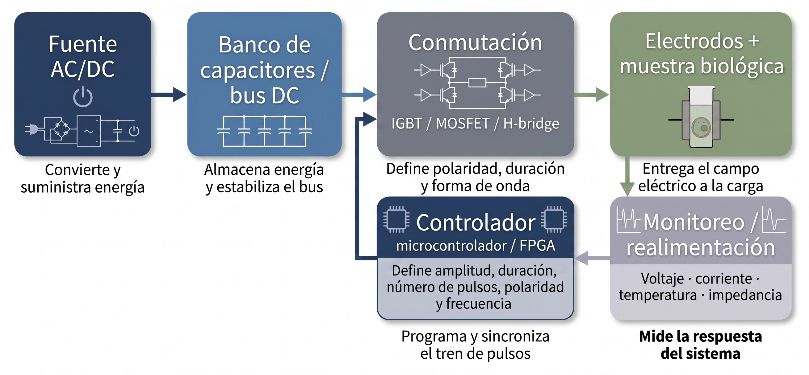

# Propósito del módulo

Un electroporador no es simplemente una fuente de alto voltaje. Es un sistema diseñado para entregar pulsos eléctricos controlados a una muestra biológica bajo condiciones reproducibles y seguras.

Este módulo presenta la arquitectura funcional básica de un electroporador y conecta sus componentes con las variables físicas estudiadas en los módulos anteriores.

# Función general

Un electroporador debe ser capaz de controlar:

- amplitud del pulso;
- duración;
- número de pulsos;
- frecuencia o intervalo entre pulsos;
- polaridad;
- forma de onda;
- energía entregada;
- corriente;
- condiciones de seguridad y monitoreo.

{fig-align="center" width="90%"}

# Bloques funcionales principales

Un sistema de electroporación típico puede dividirse en cinco bloques:

| Bloque | Función |
|---|---|
| Fuente AC/DC | convierte y suministra energía eléctrica al sistema |
| Banco de capacitores o bus DC | almacena energía y estabiliza la entrega |
| Conmutación rápida | define polaridad, duración y forma de onda |
| Controlador digital | programa amplitud, duración, número de pulsos y sincronización |
| Electrodos y muestra | entregan el campo eléctrico al sistema biológico |

# Fuente de energía

La fuente convierte la energía de entrada en una señal eléctrica adecuada para alimentar el sistema de pulsos.

Dependiendo del diseño, puede incluir:

- conversión AC/DC;
- elevación de voltaje;
- regulación;
- protección contra sobrecorriente;
- aislamiento eléctrico.

Su función no es aplicar directamente el pulso a la célula, sino alimentar de manera estable las etapas posteriores.

# Banco de capacitores o bus DC

El banco de capacitores almacena energía eléctrica antes de liberarla durante el pulso.

La energía almacenada en un capacitor ideal es:

$$
U =
\frac{1}{2}CV^2
$$

donde $C$ es la capacitancia y $V$ el voltaje de carga.

Este bloque es importante porque muchos pulsos de electroporación requieren entregar energía en tiempos muy cortos. La fuente por sí sola puede no responder con suficiente rapidez, mientras que el banco de capacitores permite liberar energía de manera controlada.

# Conmutación rápida

La etapa de conmutación define cuándo, durante cuánto tiempo y con qué polaridad se aplica el pulso.

Puede implementarse mediante dispositivos de potencia como:

- MOSFET;
- IGBT;
- tiristores;
- configuraciones tipo puente H;
- interruptores especializados de alta tensión.

Esta etapa es crítica para generar pulsos cuadrados, bipolares, bimonopolares o trenes de pulsos.

# Control digital

El controlador programa y sincroniza el protocolo eléctrico.

Puede controlar:

- amplitud;
- duración;
- número de pulsos;
- polaridad;
- intervalo entre pulsos;
- frecuencia;
- secuencias complejas;
- disparo sincronizado con mediciones.

En equipos modernos, este bloque puede implementarse mediante microcontroladores, FPGA o sistemas de adquisición y control.

# Electrodos y muestra biológica

Los electrodos son la interfaz entre el equipo y la muestra. Su geometría determina cómo se distribuye el campo eléctrico.

En una aproximación simple, para electrodos planos separados una distancia $L$, el campo promedio puede estimarse como:

$$
E_0 \approx \frac{V}{L}
$$

donde $V$ es la diferencia de potencial aplicada y $L$ la separación entre electrodos.

Sin embargo, en geometrías reales, el campo puede ser no uniforme, especialmente cerca de bordes, puntas, agujas o interfaces de tejido.

# Monitoreo y retroalimentación

Un electroporador avanzado puede monitorear variables como:

- voltaje aplicado;
- corriente;
- impedancia de la muestra;
- temperatura;
- energía entregada;
- cambios transitorios durante el pulso.

Estas mediciones son importantes porque la muestra biológica no es una carga puramente resistiva ni constante. Su impedancia puede cambiar durante la permeabilización.

# Seguridad y reproducibilidad

El uso de pulsos de alto voltaje exige condiciones de seguridad estrictas:

- aislamiento eléctrico;
- descarga segura de capacitores;
- protección del usuario;
- control de corriente;
- bloqueo de operación ante fallas;
- verificación de conexiones;
- registro de parámetros.

Desde el punto de vista científico, la reproducibilidad exige reportar claramente:

- geometría de electrodos;
- separación entre electrodos;
- voltaje aplicado;
- campo estimado;
- duración del pulso;
- número de pulsos;
- frecuencia;
- conductividad del medio;
- temperatura;
- tipo de célula o tejido.

# Conexión con los modelos físicos

Los módulos anteriores permiten interpretar lo que hace el equipo:

| Variable del equipo | Variable física relacionada |
|---|---|
| Voltaje aplicado | campo externo $E_0$ |
| Separación de electrodos | estimación de $E_0$ |
| Duración del pulso | carga RC de membrana |
| Forma de onda | polarización y respuesta temporal |
| Número de pulsos | dosis acumulada |
| Corriente | disipación Joule |
| Temperatura | daño térmico potencial |

El electroporador, por tanto, es el instrumento que convierte los modelos físicos en protocolos experimentales.

[Continuar con aplicaciones](07_aplicaciones.qmd)