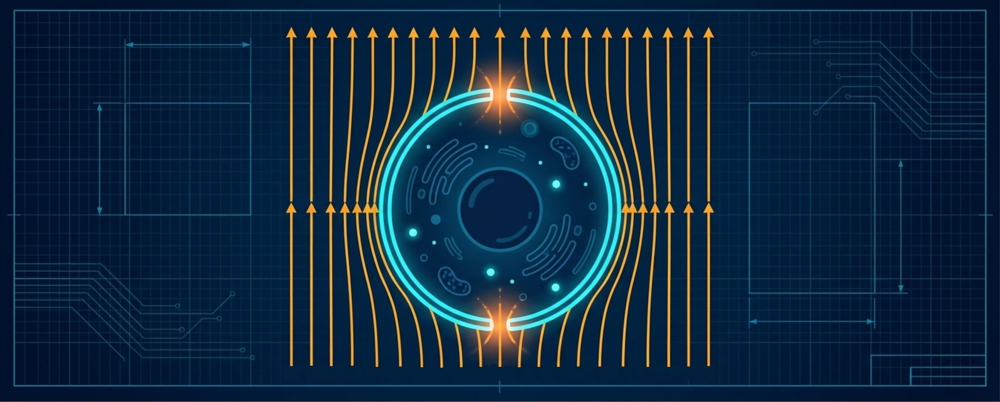

{fig-align="center" width="85%"}

# Presentación del portal

Este portal académico acompaña la clase **"La Electroporación y sus Aplicaciones"**, preparada para una prueba oral de concurso profesoral en la Universidad Nacional de Colombia, sede Medellín.

El objetivo del sitio es ampliar, con mayor detalle matemático y computacional, los principios biofísicos presentados en la clase. Mientras la presentación oral introduce los conceptos esenciales en un formato sintético, este portal ofrece deducciones paso a paso, simulaciones reproducibles e interactivas y actividades de aprendizaje para estudiantes de Ingeniería Física, Biofísica y áreas afines.

## Propósito

La electroporación es un fenómeno en el cual un campo eléctrico externo induce un aumento del voltaje transmembrana. Si dicho voltaje supera un umbral crítico, la membrana puede transitar hacia un estado permeabilizado, asociado con la formación de poros acuosos transitorios o permanentes.

Desde el punto de vista de la biofísica, este fenómeno permite conectar:

- la estructura dieléctrica de la biomembrana;
- la inducción de voltaje transmembrana;
- la dinámica capacitiva de carga de membrana;
- la nucleación y expansión de poros desde un paisaje de energía libre;
- los regímenes reversible, irreversible no térmico y térmico;
- las formas de onda usadas para modular la respuesta celular;
- la arquitectura funcional de los electroporadores;
- y las aplicaciones biomédicas, biotecnológicas e instrumentales.

## Ruta conceptual

La clase oral presenta una visión integrada del fenómeno:

1. La biomembrana como barrera selectiva y dieléctrica.
2. El aumento del voltaje transmembrana inducido por el campo externo.
3. La respuesta capacitiva de la membrana durante y después del pulso.
4. La nucleación de poros como transición termodinámica.
5. Los regímenes físicos de operación.
6. Las aplicaciones de la electroporación.

Este portal desarrolla con mayor profundidad los elementos matemáticos y computacionales que, por razones de tiempo, no pueden exponerse completamente durante una presentación oral de 30 minutos.

## Módulos del portal

### Ecuación de Schwan desde la ecuación de Laplace

Se presenta una deducción guiada de la expresión clásica para el voltaje transmembrana inducido en una célula aproximadamente esférica expuesta a un campo eléctrico uniforme:

$$
\Delta V_m^{\mathrm{ind}}(\theta)
=
f\,a\,E_0 \cos\theta
$$

donde $a$ es el radio celular, $E_0$ es la magnitud del campo externo, $\theta$ es el ángulo polar respecto a la dirección del campo y $f \approx 1{,}5$ es el factor geométrico para una célula esférica ideal. El módulo incluye la deducción desde la ecuación de Laplace, la condición de continuidad en la interfaz membrana–medio y la interpretación física de cada término.

### Dinámica temporal de carga de membrana

Se introduce el modelo de circuito RC equivalente para explicar que la membrana no alcanza instantáneamente su voltaje inducido máximo. Para un pulso rectangular que comienza en $t_0$, la evolución temporal es:

$$
\Delta V_m^{\mathrm{ind}}(t)
=
f\,a\,E_0 \cos\theta
\left(1-e^{-(t-t_0)/\tau_m}\right)
\qquad
t_0 \leq t \leq t_0 + t_p
$$

donde $\tau_m$ es la constante de tiempo efectiva de carga de la membrana y $t_p$ es la duración del pulso. Al cesar el pulso, la contribución inducida decae exponencialmente con la misma constante de tiempo. El módulo incluye una simulación interactiva con control sobre el tiempo de inicio del pulso $t_0$, la duración $t_p$, la constante de tiempo $\tau_m$ y el voltaje máximo inducido.

### Energía libre de formación de poros

Se analiza el paisaje energético asociado a la nucleación y expansión de poros en la membrana a partir de la energía libre de Gibbs. El modelo simplificado de tres términos es:

$$
\Delta G\!\left(r,V_m^{\mathrm{tot}}\right)
\approx
\underbrace{2\pi r\gamma}_{\text{borde}}
-
\underbrace{\pi r^2\Gamma}_{\text{tensión}}
-
\underbrace{k r^2 \left(V_m^{\mathrm{tot}}\right)^2}_{\text{eléctrico}}
$$

donde $r$ es el radio del poro, $\gamma$ la energía de línea del borde hidrofílico, $\Gamma$ la tensión superficial efectiva de la membrana y $k$ el coeficiente eléctrico efectivo.

El módulo deduce el origen físico de cada parámetro. En particular:

- $\gamma$ se estima a partir de la tensión interfacial agua–hidrocarburo y el grosor de membrana.
- $\Gamma$ representa la tensión superficial de la bicapa bajo campo.
- $k$ se deriva desde las permitividades del agua y la membrana: $k \approx \pi(\varepsilon_w - \varepsilon_m)\varepsilon_0 / d_m \approx 556~\mathrm{mF/m^2}$.

El módulo también clarifica la distinción entre las tres barreras del paisaje energético completo: la barrera hidrofóbica (a radios $< 0.3$ nm), la barrera de nucleación hidrofílica ($\Delta G_c$, que es la que el simulador reproduce) y la barrera de ruptura irreversible (visible a voltajes bajos como un segundo tramo ascendente). El concepto de nucleación se introduce explícitamente.

### Calentamiento Joule durante pulsos eléctricos

Se estudia cómo la disipación eléctrica puede contribuir al aumento de temperatura del medio. Bajo una aproximación adiabática mínima para un pulso de duración $\tau$:

$$
\Delta T
\approx
\frac{\sigma E^2 \tau}{\rho c_p}
$$

donde $\sigma$ es la conductividad del medio, $E$ el campo eléctrico, $\rho$ la densidad y $c_p$ el calor específico. La dependencia cuadrática en $E$ implica que pequeños incrementos del campo pueden producir aumentos térmicos significativos.

Este módulo permite distinguir entre:

- **electroporación reversible**: voltaje suficiente para nuclear poros, calentamiento despreciable;
- **electroporación irreversible no térmica**: campo suficientemente alto para producir poros permanentes sin daño térmico apreciable;
- **daño térmico**: disipación acumulada que supera umbrales biológicos, especialmente en trenes de pulsos, medios de alta conductividad o campos muy intensos.

### Actividades de aprendizaje

El portal incluye actividades numéricas y conceptuales diseñadas para promover una comprensión activa del fenómeno. Cada actividad cuenta con:

- un enunciado con contexto físico y procedimiento;
- una **pista colapsable** que orienta sin revelar la respuesta;
- una **respuesta colapsable** con desarrollo completo e interpretación física.

Las actividades cubren los cuatro módulos y culminan en una **actividad integradora** en la que el estudiante aplica simultáneamente la ecuación de Schwan, el modelo RC, el paisaje energético y el calentamiento Joule para comparar tres protocolos de electroporación.

## Uso sugerido

Este portal puede utilizarse de tres maneras:

1. Como material de consulta posterior a la clase.
2. Como apoyo para resolver ejercicios y explorar simulaciones interactivas.
3. Como base para discusión en cursos de Biofísica, Ingeniería Física, Biotecnología o Ingeniería Biomédica.

## Nota sobre los modelos

Los modelos presentados en este portal son aproximaciones biofísicas diseñadas para construir intuición cuantitativa. No deben interpretarse como descripciones completas de todos los fenómenos moleculares, celulares o tisulares involucrados en la electroporación.

En particular, los umbrales de permeabilización dependen de múltiples factores, entre ellos el tipo celular, la geometría celular, la composición de la membrana, el medio extracelular, la duración del pulso, la forma de onda, la temperatura y la historia previa de exposición eléctrica.

Adicionalmente, el modelo energético simplificado de tres términos no reproduce el paisaje completo de la literatura: a voltajes bajos, el modelo completo exhibe una segunda barrera de ruptura irreversible ($\sim 300\,k_BT$) y una barrera hidrofóbica previa a la nucleación hidrofílica, ninguna de las cuales está incluida en el modelo simplificado. Estas limitaciones se discuten explícitamente en el módulo correspondiente.

Por estas razones, las ecuaciones simplificadas deben entenderse como herramientas de análisis físico, no como fronteras universales exactas.

## Relación con la presentación oral

La presentación oral introduce el fenómeno de electroporación desde una perspectiva de biofísica aplicada. Este portal extiende esa presentación mediante:

- deducciones matemáticas paso a paso desde primeros principios;
- simulaciones interactivas reproducibles en el navegador (OJS/Observable Plot);
- código reproducible en Python para Google Colab;
- interpretación física de parámetros con justificación desde la física de dieléctricos y termodinámica de superficies;
- actividades de aprendizaje con pistas y respuestas colapsables;
- bibliografía básica para profundización.

Así, la clase y el portal funcionan como dos componentes complementarios: la presentación comunica la estructura conceptual general, mientras que el portal permite estudiar con más detalle los modelos físicos que sustentan el fenómeno.

## Bibliografía básica

Las referencias principales empleadas en este portal son:

- @Kotnik2019 — revisión comprehensiva de los mecanismos y modelos de electroporación de membrana.
- @Weaver1996 — revisión de la teoría de electroporación, fuente de los parámetros energéticos del poro.
- @Yarmush2014 — revisión de tecnologías basadas en electroporación para medicina.
- @Kotnik1998 — evolución temporal del voltaje transmembrana inducido por campos variables.
- @Bilska2000 — análisis del voltaje transmembrana inducido en células esféricas.
- @Kotnik2000 — dependencia de la frecuencia del voltaje transmembrana inducido.
- @Bockmann2008 — cinética, estadística y energética de la electroporación de membrana lipídica por dinámica molecular.
- @Rems2017 — modelado de la nucleación de poros en membranas lipídicas.
- @Kotulska2007 — propiedades estadísticas de los poros de electroporación.
- @Antonov2009 — formación de poros inducidos por voltaje en membranas lipídicas planas.
